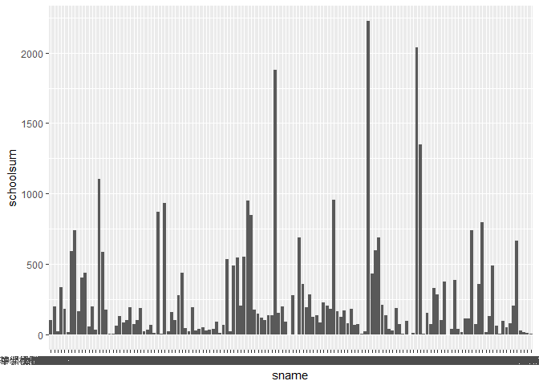

106-2 大數據分析方法 作業二
================
Yi-Ju Tseng

作業完整說明[連結](https://docs.google.com/document/d/1aLGSsGXhgOVgwzSg9JdaNz2qGPQJSoupDAQownkGf_I/edit?usp=sharing)

學習再也不限定在自己出生的國家，台灣每年有許多學生選擇就讀國外的大專院校，同時也有人多國外的學生來台灣就讀，透過分析[大專校院境外學生人數統計](https://data.gov.tw/dataset/6289)、[大專校院本國學生出國進修交流數](https://data.gov.tw/dataset/24730)、[世界各主要國家之我國留學生人數統計表](https://ws.moe.edu.tw/Download.ashx?u=C099358C81D4876CC7586B178A6BD6D5062C39FB76BDE7EC7685C1A3C0846BCDD2B4F4C2FE907C3E7E96F97D24487065577A728C59D4D9A4ECDFF432EA5A114C8B01E4AFECC637696DE4DAECA03BB417&n=4E402A02CE6F0B6C1B3C7E89FDA1FAD0B5DDFA6F3DA74E2DA06AE927F09433CFBC07A1910C169A1845D8EB78BD7D60D7414F74617F2A6B71DC86D17C9DA3781394EF5794EEA7363C&icon=..csv)可以了解103年以後各大專院校國際交流的情形。請同學分析以下議題，並以視覺化的方式呈現分析結果，呈現103年以後大專院校國際交流的情形。

來台境外生分析
--------------

### 資料匯入與處理

``` r
library(readr)
```

    ## Warning: package 'readr' was built under R version 3.4.4

``` r
library(dplyr)
```

    ## 
    ## Attaching package: 'dplyr'

    ## The following objects are masked from 'package:stats':
    ## 
    ##     filter, lag

    ## The following objects are masked from 'package:base':
    ## 
    ##     intersect, setdiff, setequal, union

``` r
library(knitr)
```

    ## Warning: package 'knitr' was built under R version 3.4.4

``` r
library(ggplot2)
```

    ## Warning: package 'ggplot2' was built under R version 3.4.4

``` r
library(choroplethr)
```

    ## Warning: package 'choroplethr' was built under R version 3.4.4

    ## Loading required package: acs

    ## Warning: package 'acs' was built under R version 3.4.4

    ## Loading required package: stringr

    ## Warning: package 'stringr' was built under R version 3.4.4

    ## Loading required package: XML

    ## Warning: package 'XML' was built under R version 3.4.4

    ## 
    ## Attaching package: 'acs'

    ## The following object is masked from 'package:dplyr':
    ## 
    ##     combine

    ## The following object is masked from 'package:base':
    ## 
    ##     apply

``` r
library(choroplethrMaps)
```

    ## Warning: package 'choroplethrMaps' was built under R version 3.4.4

``` r
library(rgdal)
```

    ## Warning: package 'rgdal' was built under R version 3.4.4

    ## Loading required package: sp

    ## Warning: package 'sp' was built under R version 3.4.4

    ## rgdal: version: 1.2-20, (SVN revision 725)
    ##  Geospatial Data Abstraction Library extensions to R successfully loaded
    ##  Loaded GDAL runtime: GDAL 2.2.3, released 2017/11/20
    ##  Path to GDAL shared files: C:/Users/yijie/Documents/R/win-library/3.4/sf/gdal
    ##  GDAL binary built with GEOS: TRUE 
    ##  Loaded PROJ.4 runtime: Rel. 4.9.3, 15 August 2016, [PJ_VERSION: 493]
    ##  Path to PROJ.4 shared files: C:/Users/yijie/Documents/R/win-library/3.4/sf/proj
    ##  Linking to sp version: 1.2-7

``` r
library(rgeos)
```

    ## Warning: package 'rgeos' was built under R version 3.4.4

    ## rgeos version: 0.3-26, (SVN revision 560)
    ##  GEOS runtime version: 3.6.1-CAPI-1.10.1 r0 
    ##  Linking to sp version: 1.2-7 
    ##  Polygon checking: TRUE

``` r
library(maptools)
```

    ## Warning: package 'maptools' was built under R version 3.4.4

    ## Checking rgeos availability: TRUE

``` r
library(RColorBrewer)
`103_ab103_C` <- read.csv("C:/Users/yijie/Downloads/103_ab103_C.csv")
`103_ab103_S` <- read.csv("C:/Users/yijie/Downloads/103_ab103_S.csv")
`104_ab104_C` <- read.csv("C:/Users/yijie/Downloads/104_ab104_C.csv")
`104_ab104_S` <- read.csv("C:/Users/yijie/Downloads/104_ab104_S.csv")
`105_ab105_C` <- read.csv("C:/Users/yijie/Downloads/105_ab105_C.csv")
`105_ab105_S` <- read.csv("C:/Users/yijie/Downloads/105_ab105_S.csv")
`106_ab105_C` <- read.csv("C:/Users/yijie/Downloads/106_ab105_C.csv")
`106_ab105_S` <- read.csv("C:/Users/yijie/Downloads/106_ab105_S.csv")
CountriesComparisionTable <- read_csv("C:/Users/yijie/Downloads/CountriesComparisionTable.csv")
```

    ## Parsed with column specification:
    ## cols(
    ##   ISO3 = col_character(),
    ##   English = col_character(),
    ##   Taiwan = col_character()
    ## )

### 請問哪些國家來台灣唸書的學生最多呢？取出前十名的國家與總人數，由大到小排序，加總103年以後的資料。

``` r
`103_ab103_C`$t103<-rowSums(`103_ab103_C`[,3:11])#新增欄位填入人數總和，總和是3到11 col的sum
`104_ab104_C`$t104<-rowSums(`104_ab104_C`[,3:11])
`105_ab105_C`$t105<-rowSums(`105_ab105_C`[,3:11])
`106_ab105_C`$t106<-rowSums(`106_ab105_C`[,3:11])

X103<-`103_ab103_C`[order(`103_ab103_C`$t103,decreasing = T),][1:11,c(2,12)]#依人數總和由大到小排序11名
X104<-`104_ab104_C`[order(`104_ab104_C`$t104,decreasing = T),][1:11,c(2,12)]#，只取2跟12col
X105<-`105_ab105_C`[order(`105_ab105_C`$t105,decreasing = T),][1:11,c(2,12)]
X106<-`106_ab105_C`[order(`106_ab105_C`$t106,decreasing = T),][1:11,c(2,12)]

X103456<-inner_join(X103,inner_join(X104,inner_join(X105,X106)))#將四個資料表合併
```

    ## Joining, by = "國別"

    ## Warning: Column `國別` joining factors with different levels, coercing to
    ## character vector

    ## Joining, by = "國別"

    ## Warning: Column `國別` joining factor and character vector, coercing into
    ## character vector

    ## Joining, by = "國別"

    ## Warning: Column `國別` joining factor and character vector, coercing into
    ## character vector

``` r
X103456$t<-rowSums(X103456[,2:5])#新增總和欄位，填入2到5col的sum
kable(X103456[order(X103456$t,decreasing = T),][1:10,c(1,6)])#依人數總和由大到小排序10名，只取1跟6 col
```

|     | 國別     |       t|
|-----|:---------|-------:|
| 1   | 中國大陸 |  152524|
| 2   | 馬來西亞 |   62031|
| 3   | 香港     |   31940|
| 4   | 日本     |   28200|
| 6   | 越南     |   21670|
| 5   | 澳門     |   20302|
| 8   | 印尼     |   19620|
| 7   | 南韓     |   16948|
| 9   | 美國     |   14846|
| 11  | 泰國     |    7035|

### 哪間大學的境外生最多呢？取出前十名的大學與總人數，由大到小排序，加總103年以後的資料。

``` r
`103_ab103_S`$t103<-rowSums(`103_ab103_S`[,4:12])#新增欄位填入人數總和，總和是4到12 col的sum
`104_ab104_S`$t104<-rowSums(`104_ab104_S`[,4:12])
`105_ab105_S`$t105<-rowSums(`105_ab105_S`[,4:12])
`106_ab105_S`$t106<-rowSums(`106_ab105_S`[,4:12])

ab103<-`103_ab103_S`[order(`103_ab103_S`$t103,decreasing = T),][1:20,c(3,13)]#依人數總和由大到小排序20名
ab104<-`104_ab104_S`[order(`104_ab104_S`$t104,decreasing = T),][1:20,c(3,13)]#，只取2跟12col
ab105<-`105_ab105_S`[order(`105_ab105_S`$t105,decreasing = T),][1:20,c(3,13)]
ab106<-`106_ab105_S`[order(`106_ab105_S`$t106,decreasing = T),][1:20,c(3,13)]

ab103456<-inner_join(ab103,inner_join(ab104,inner_join(ab105,ab106)))#將四個資料表合併
```

    ## Joining, by = "學校名稱"

    ## Warning: Column `學校名稱` joining factors with different levels, coercing
    ## to character vector

    ## Joining, by = "學校名稱"

    ## Warning: Column `學校名稱` joining factor and character vector, coercing
    ## into character vector

    ## Joining, by = "學校名稱"

    ## Warning: Column `學校名稱` joining factor and character vector, coercing
    ## into character vector

``` r
ab103456$t<-rowSums(ab103456[,2:5])#新增總和欄位，填入2到5col的sum
kable(ab103456[order(ab103456$t,decreasing = T),][1:10,c(1,6)])#依人數總和由大到小排序10名，只取1跟6 col
```

|     | 學校名稱         |      t|
|-----|:-----------------|------:|
| 1   | 國立臺灣師範大學 |  22113|
| 3   | 國立臺灣大學     |  18199|
| 2   | 中國文化大學     |  16074|
| 4   | 銘傳大學         |  16057|
| 5   | 淡江大學         |  13887|
| 6   | 國立政治大學     |  11626|
| 7   | 國立成功大學     |  10982|
| 8   | 輔仁大學         |   9499|
| 9   | 逢甲大學         |   9474|
| 13  | 中原大學         |   7662|

### 用bar chart呈現各個國家(全部)來台灣唸書的學生人數

``` r
XX103<-`103_ab103_C`[,c(2,12)]#資料只取2跟12 col
XX104<-`104_ab104_C`[,c(2,12)]
XX105<-`105_ab105_C`[,c(2,12)]
XX106<-`106_ab105_C`[,c(2,12)]

XX103456<-full_join(XX103,full_join(XX104,full_join(XX105,XX106)))#將四個資料表合併
```

    ## Joining, by = "國別"

    ## Warning: Column `國別` joining factors with different levels, coercing to
    ## character vector

    ## Joining, by = "國別"

    ## Warning: Column `國別` joining factor and character vector, coercing into
    ## character vector

    ## Joining, by = "國別"

    ## Warning: Column `國別` joining factor and character vector, coercing into
    ## character vector

``` r
XX103456[is.na(XX103456)]<-0#將NA設為0，方便計算
XX103456$t<-rowSums(XX103456[,2:5])#新增總和欄位，填入2到5col的sum
colnames(XX103456)[1]<-"country"#為避免錯誤所以將colname改成英文

ggplot()+geom_bar(data=XX103456,aes(x=country,y=t),stat = "identity")#畫圖
```


### 用面量圖呈現各個國家來台灣唸書的學生人數，人數越多顏色越深

``` r
`103_ab103_C` <- read.csv("C:/Users/yijie/Downloads/103_ab103_C.csv")
`104_ab104_C` <- read.csv("C:/Users/yijie/Downloads/104_ab104_C.csv")
`105_ab105_C` <- read.csv("C:/Users/yijie/Downloads/105_ab105_C.csv")
`106_ab105_C` <- read.csv("C:/Users/yijie/Downloads/106_ab105_C.csv")
CountriesComparisionTable <- read_csv("C:/Users/yijie/Downloads/CountriesComparisionTable.csv")
```

    ## Parsed with column specification:
    ## cols(
    ##   ISO3 = col_character(),
    ##   English = col_character(),
    ##   Taiwan = col_character()
    ## )

``` r
`103_ab103_C`$t103<-rowSums(`103_ab103_C`[,3:11])#新增欄位填入人數總和，總和是3到11 col的sum
`104_ab104_C`$t104<-rowSums(`104_ab104_C`[,3:11])
`105_ab105_C`$t105<-rowSums(`105_ab105_C`[,3:11])
`106_ab105_C`$t106<-rowSums(`106_ab105_C`[,3:11])

XXX103<-`103_ab103_C`[,c(2,12)]#資料只取2跟12 col
XXX104<-`104_ab104_C`[,c(2,12)]
XXX105<-`105_ab105_C`[,c(2,12)]
XXX106<-`106_ab105_C`[,c(2,12)]

XXX103456<-full_join(XXX103,full_join(XXX104,full_join(XXX105,XXX106)))#將四個資料表合併
```

    ## Joining, by = "國別"

    ## Warning: Column `國別` joining factors with different levels, coercing to
    ## character vector

    ## Joining, by = "國別"

    ## Warning: Column `國別` joining factor and character vector, coercing into
    ## character vector

    ## Joining, by = "國別"

    ## Warning: Column `國別` joining factor and character vector, coercing into
    ## character vector

``` r
XXX103456$t<-rowSums(XXX103456[,2:5])#新增總和欄位，填入2到5col的sum
XXX103456<-XXX103456[,c(1,6)]#資料只取1跟6 col

colnames(CountriesComparisionTable)[3]<-"國別"#為方便join所以改colname
country.name<-right_join(CountriesComparisionTable,XXX103456,by="國別")#以國別為key合併兩張資料表
country.name<-country.name[complete.cases(country.name),]#留下非空值的資料


world <- readShapeSpatial("C:/Users/yijie/Downloads/TM_WORLD_BORDERS-0.3/TM_WORLD_BORDERS-0.3.shp")#匯入世界地圖
```

    ## Warning: use rgdal::readOGR or sf::st_read

    ## Warning: use rgdal::readOGR or sf::st_read

``` r
world.df <-fortify(world, region = "ISO3")

colnames(world.df)[6]<-"ISO3"#為方便join所以改colname
final.plot<-merge(world.df,country.name,by="ISO3",all.x=T)#以ISO3為key合併兩張資料表
final.plot<-final.plot[order(final.plot$order),]#以資料裡的order排序資料

twcmap<-ggplot() +       #畫面量圖
  geom_polygon(data = final.plot, 
               aes(x =long, y =lat,
                   group=group,
                   fill = t), 
               color = "gray", 
               size = 0.1) + 
  coord_map()+
  scale_fill_gradientn(
    colours = brewer.pal(5,"Reds"))+
  theme_void()
twcmap
```


台灣學生國際交流分析
--------------------

### 資料匯入與處理

``` r
Student_RPT_07 <- read.csv("C:/Users/yijie/Downloads/Student_RPT_07.csv")
```

### 台灣大專院校的學生最喜歡去哪些國家進修交流呢？請取出前十名的國家與總人數，由大到小排序

``` r
Student_RPT_07 <- read.csv("C:/Users/yijie/Downloads/Student_RPT_07.csv", stringsAsFactors=FALSE)
colnames(Student_RPT_07)[4]<-"Taiwan"#為方便join所以改colname
colnames(Student_RPT_07)[7]<-"total"#為避免錯誤所以將colname改成英文

Student<-group_by(Student_RPT_07,Taiwan)%>%#以Taiwan分組
  summarise(schoolsum=sum(total))#加總人數
orderstudent<-head(order(Student$schoolsum,decreasing = T),10)#以人數由大排到小取前十
kable(Student[orderstudent,])
```

| Taiwan   |  schoolsum|
|:---------|----------:|
| 中國大陸 |       8375|
| 美國     |       4427|
| 南韓     |       2050|
| 大陸地區 |       1516|
| 德國     |       1466|
| 法國     |       1258|
| 英國     |        742|
| 加拿大   |        689|
| 西班牙   |        642|
| 香港     |        572|

### 加總103年以後的資料，哪間大學的出國交流學生數最多呢？取出前十名的大學與總人數，由大到小排序

``` r
Student_RPT_07 <- read.csv("C:/Users/yijie/Downloads/Student_RPT_07.csv", stringsAsFactors=FALSE)
colnames(Student_RPT_07)[3]<-"sname"#為避免錯誤所以將colname改成英文
colnames(Student_RPT_07)[7]<-"total"#為避免錯誤所以將colname改成英文
Student_RPT<-group_by(Student_RPT_07,sname)%>%#以sname分組
  summarise(schoolsum=sum(total))#加總人數
orderschool<-head(order(Student_RPT$schoolsum,decreasing = T),10)#以人數由大排到小取前十
kable(Student_RPT[orderschool,])
```

| sname        |  schoolsum|
|:-------------|----------:|
| 國立臺灣大學 |       2224|
| 淡江大學     |       2038|
| 國立政治大學 |       1876|
| 逢甲大學     |       1346|
| 元智大學     |       1106|
| 國立臺北大學 |        956|
| 國立交通大學 |        951|
| 東海大學     |        931|
| 東吳大學     |        873|
| 國立成功大學 |        846|

### 用bar chart呈現台灣大專院校(全部)的學生去各國家進修交流人數

``` r
ggplot()+geom_bar(data=Student_RPT,aes(x=sname,y=schoolsum),stat = "identity")#畫bar圖
```

    ## Warning: Removed 3 rows containing missing values (position_stack).



### 用面量圖呈現台灣大專院校的學生去各國家進修交流人數，人數越多顏色越深

``` r
CountriesComparisionTable <- read_csv("C:/Users/yijie/Downloads/CountriesComparisionTable.csv")
```

    ## Parsed with column specification:
    ## cols(
    ##   ISO3 = col_character(),
    ##   English = col_character(),
    ##   Taiwan = col_character()
    ## )

``` r
colnames(Student_RPT_07)[4]<-"Taiwan"#為方便join所以改colname
CountriesComparisionTable[48,3]<-"中國大陸"#為方便join所以把原本的中國;大陸改為中國大陸

schoolcountry.name<-right_join(CountriesComparisionTable,Student_RPT_07,by="Taiwan")#併兩張資料表
schoolcountry.name<-schoolcountry.name[complete.cases(schoolcountry.name),]#保留非空值

world <- readShapeSpatial("C:/Users/yijie/Downloads/TM_WORLD_BORDERS-0.3/TM_WORLD_BORDERS-0.3.shp")#匯入世界地圖
```

    ## Warning: use rgdal::readOGR or sf::st_read

    ## Warning: use rgdal::readOGR or sf::st_read

``` r
world.df <-fortify(world, region = "ISO3")

Student<-group_by(schoolcountry.name,ISO3)%>%#以ISO3分組
  summarise(schoolsum=sum(total))#加總人數

colnames(world.df)[6]<-"ISO3"#為方便join所以改colname
final<-merge(world.df,Student,by="ISO3",all.x=T)#以ISO3為key合併
final<-final[order(final$order),]#以資料裡的order排序資料

sixmap<-ggplot() +#畫世界面量圖
  geom_polygon(data = final, 
               aes(x =long, y =lat,
                   group=group,
                   fill =schoolsum), 
               color = "gray", 
               size = 0.1) + 
  coord_map()+
  scale_fill_gradientn(
    colours = brewer.pal(5,"Reds"))+
  theme_void()
sixmap
```


台灣學生出國留學分析
--------------------

### 資料匯入與處理

``` r
`105c.`<- read.csv("C:/Users/yijie/Downloads/105c .csv")
```

### 台灣學生最喜歡去哪些國家留學呢？取出前十名的國家與總人數，由大到小排序

``` r
`105c.`<- read.csv("C:/Users/yijie/Downloads/105c .csv",stringsAsFactor=F)
colnames(`105c.`)[3]<-"tot"#為避免錯誤所以將colname改成英文
seven<-head(`105c.`<-`105c.`[order(`105c.`$tot,decreasing = T),],10)#以人數由大排到小取前十
kable(seven[,2:3])
```

|     | 國別     |    tot|
|-----|:---------|------:|
| 14  | 美國     |  21127|
| 15  | 澳大利亞 |  13582|
| 17  | 日本     |   8444|
| 13  | 加拿大   |   4827|
| 1   | 英國     |   3815|
| 2   | 德國     |   1488|
| 16  | 紐西蘭   |   1106|
| 3   | 波蘭     |    561|
| 21  | 馬來西亞 |    502|
| 4   | 奧地利   |    419|

### 用面量圖呈現台灣學生去各國家留學人數，人數越多顏色越深

``` r
CountriesComparisionTable <- read_csv("C:/Users/yijie/Downloads/CountriesComparisionTable.csv")
```

    ## Parsed with column specification:
    ## cols(
    ##   ISO3 = col_character(),
    ##   English = col_character(),
    ##   Taiwan = col_character()
    ## )

``` r
`105c.`<- read.csv("C:/Users/yijie/Downloads/105c .csv",stringsAsFactor=F)
colnames(`105c.`)[2]<-"Taiwan"#為方便join所以改colname

stucountry.name<-right_join(CountriesComparisionTable,`105c.`,by="Taiwan")#以Taiwan為key合併
stucountry.name<-stucountry.name[complete.cases(stucountry.name),]#保留非空值

world <- readShapeSpatial("C:/Users/yijie/Downloads/TM_WORLD_BORDERS-0.3/TM_WORLD_BORDERS-0.3.shp")#匯入世界地圖
```

    ## Warning: use rgdal::readOGR or sf::st_read

    ## Warning: use rgdal::readOGR or sf::st_read

``` r
world.df <-fortify(world, region = "ISO3")

colnames(world.df)[6]<-"ISO3"#為方便join所以改colname
final<-merge(world.df,stucountry.name,by="ISO3",all.x=T)#以ISO3為key合併
final<-final[order(final$order),]#以資料裡的order排序資料
colnames(final)[11]<-"totalpo"#為避免錯誤所以將colname改成英文


sevenmap<-ggplot() +#畫世界面量圖
  geom_polygon(data = final, 
               aes(x =long, y =lat,
                   group=group,
                   fill =totalpo), 
               color = "gray", 
               size = 0.1) + 
  coord_map()+
  scale_fill_gradientn(
    colours = brewer.pal(5,"Reds"))+
  theme_void()
sevenmap
```


綜合分析
--------

來台讀書與離台讀書的來源國與留學國趨勢是否相同？想來台灣唸書的境外生，他們的母國也有很多台籍生嗎？圖文並茂說明我的觀察。

趨勢相同，他們的母國也有很多台籍生，由下面兩張面量圖可知

### 第一張面量圖呈現各個國家來台灣唸書的學生人數，人數越多顏色越深

### 第二張面量圖呈現台灣大專院校的學生去各國家進修交流人數，人數越多顏色越深

``` r
twcmap
```


``` r
sixmap
```


